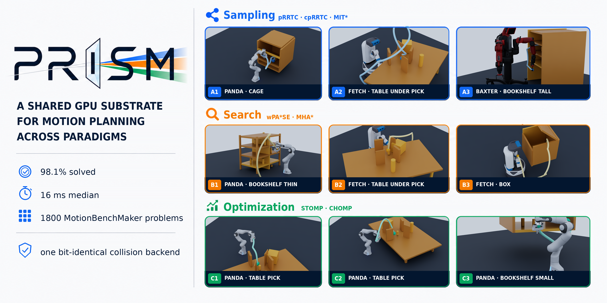
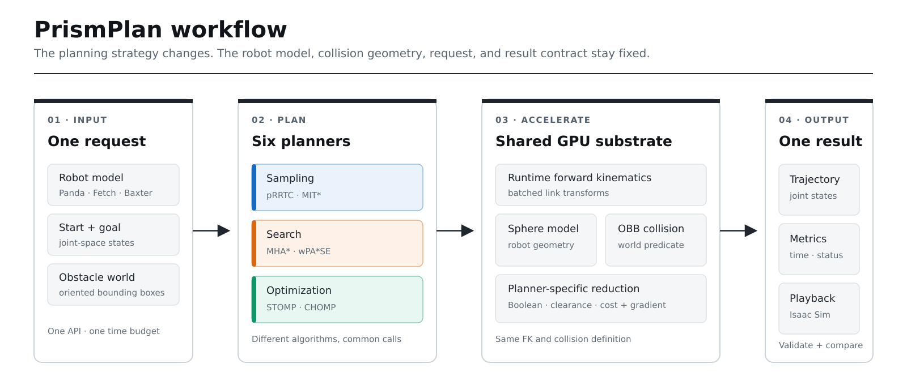
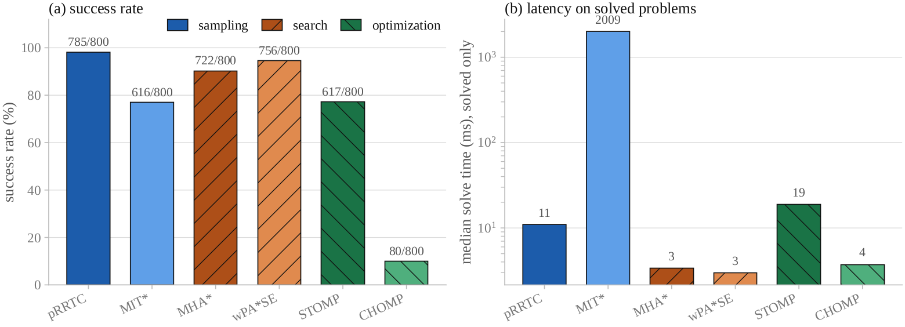
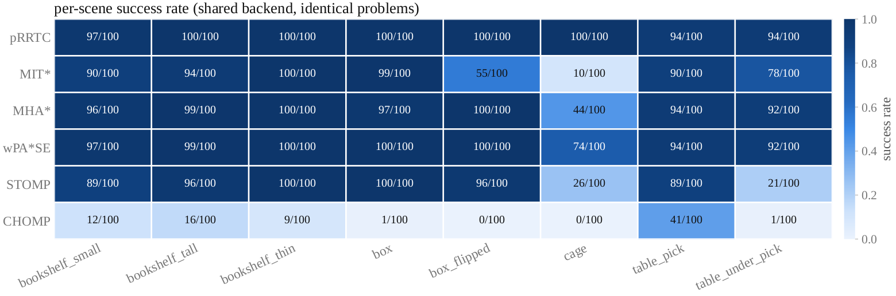
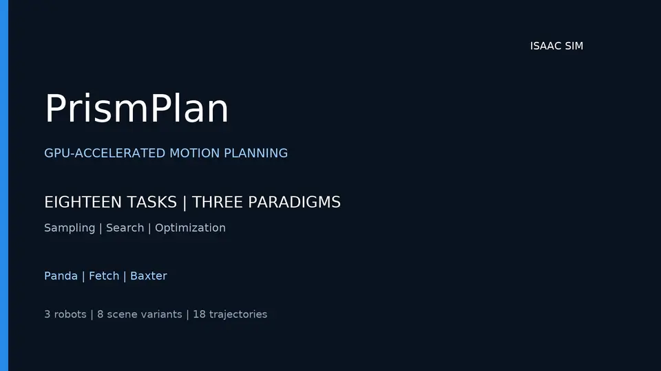

<p align="center">
  
</p>

# PrismPlan

**A shared GPU collision–kinematics substrate for sampling-, search-, and optimization-based motion planning.**

🌐 **Project page: [xiaoyubotmotionteam.github.io/PrismPlan](https://xiaoyubotmotionteam.github.io/PrismPlan/)**

PrismPlan exposes six planners through one runtime robot interface and reduces their collision and forward-kinematics workloads onto shared batched GPU primitives. Holding the robot model, obstacle representation, collision predicate, request, and time budget fixed makes cross-paradigm comparisons meaningful: the measured differences come from the planners rather than incompatible backends.

## Highlights

- **One substrate, three paradigms.** Sampling, search, and optimization share the same per-sphere geometry and runtime kinematics substrate.
- **Six first-class planners.** pRRTC, MIT*, MHA*, wPA*SE, STOMP, and CHOMP use a common problem description and result interface.
- **Runtime robot models.** The same planner binaries run Panda (7 DoF), Fetch (8 DoF), and a whole-body Baxter composite (14 DoF) without planner-specific recompilation.
- **Backend-fixed benchmarking.** Every planner receives the same start/goal pair, OBB scene, and collision model; `--budget-ms` sets one wall-clock budget for all six.
- **Simulation-ready outputs.** Saved trajectories can be replayed in Isaac Sim; the README includes reviewed multi-scene demos.

## How it works

<p align="center">
  
</p>

All planners share the runtime FK and per-sphere collision geometry. Sampling and search reduce it to an any-collision predicate; the anytime sampler uses a minimum-clearance reduction; STOMP and CHOMP use summed-hinge costs and gradients built from the same geometry. This distinction is intentional: an optimizer needs a graded signal, while a feasibility planner needs a Boolean decision.

| Planner | Paradigm | Execution model | Practical role |
|---|---|---|---|
| pRRTC | sampling | GPU-parallel tree extension | High feasibility and high-dimensional robustness |
| MIT* | anytime-optimal sampling | GPU collision/FK primitives | Trades the time budget for shorter paths |
| MHA* | heuristic search | CPU open lists, GPU batched edge checks | Multiple complementary heuristics |
| wPA*SE | parallel bounded-suboptimal search | CPU search, GPU batched edge checks | Low median latency and a suboptimality bound |
| STOMP | derivative-free optimization | GPU-batched rollouts and costs | Local trajectory refinement without gradients |
| CHOMP | gradient-based optimization | Shared differentiable obstacle cost | Smooth local optimization from a useful seed |

MHA* and wPA*SE are hybrid CPU/GPU planners, not fully GPU-resident search implementations.

## Results at a glance

The main comparison uses 800 MotionBenchMaker Panda problems, one RTX 3060, and an equal 2 s wall-clock budget per planner and problem. Fifteen requests have a goal already in collision; the overall success denominator retains them, while “feasible success” excludes them. The figures use the paper's `mbm_800_flag` run; see [benchmark provenance and reproduction](docs/benchmark.md).

<p align="center">
  
</p>

pRRTC solves 785/800 problems (98.1%, all 785 feasible requests); wPA*SE solves 756/800 (94.5%) with a 3.0 ms median on solved requests, compared with pRRTC's 11.0 ms. These medians cover each planner's own solved subset. The per-scene view shows where the paradigms separate: `cage` is the strongest discriminator, while `table_under_pick` is especially difficult for unseeded local optimizers.

<p align="center">
  
</p>

## Isaac Sim demos

Watch eighteen time-parameterized trajectories across sampling, search, and optimization planners on Panda, Fetch, and Baxter. The 52-second overview opens with nine trajectories, then shows Panda, Fetch, and Baxter in sequence, each with three scenes playing simultaneously in a three-panel layout.

<p align="center">
  <a href="docs/assets/video/prismplan_eighteen_trajectories.mp4">
    
  </a><br>
  <sub>Eighteen tasks · three planning paradigms · three robot models<br>
  <a href="docs/assets/video/prismplan_eighteen_trajectories.mp4">Watch the overview (52 s)</a> · <a href="docs/assets/video/prismplan_demo.mp4">Watch the full demo (2 min 9 s)</a></sub>
</p>

The full demo presents the first nine trajectories individually, followed by the same three views of Panda, Fetch, and Baxter, each showing three scenes simultaneously.

Isaac Sim is used for state and trajectory visualization. Benchmark timings and planner collision decisions come from PrismPlan; they are not Isaac physics-step timings.

## Build

### Requirements

- Linux with a CUDA-capable NVIDIA GPU
- CMake 3.16 or newer, a C++17 compiler, and the CUDA toolkit with `nvcc`
- Eigen3 and pybind11 (the commands below use 2.13.6, including for Python 3.12)
- Python 3 with NumPy, PyYAML, CUDA-enabled PyTorch, and Matplotlib for the Python API and benchmark tools

The default CUDA architecture is `86` (Ampere). Override `CMAKE_CUDA_ARCHITECTURES` for another GPU; for example, use `120` for an RTX 5060 Ti with CUDA 13.2.

Activate the Python environment containing these dependencies before building,
and use that same environment to run the examples. Check the toolchain and GPU:

```bash
nvcc --version
nvidia-smi
python3 -c 'import numpy, yaml, matplotlib, torch; assert torch.cuda.is_available(), "PyTorch cannot access CUDA"'
```

If `nvcc` is installed outside `PATH`, set `CUDACXX` to its actual path before
configuring, for example `export CUDACXX=/usr/local/cuda-13.2/bin/nvcc`.
A working compiler alone does not establish that the NVIDIA driver or PyTorch
can run GPU workloads.

Install pybind11 in the active Python environment and pass its CMake directory
explicitly. This avoids picking up an older system copy: pybind11 2.9.1 fails
to compile these bindings with Python 3.12.

```bash
python3 -m pip install pybind11==2.13.6
```

```bash
cd code/gpu_planning
cmake -S cpp -B cpp/build \
  -DCMAKE_BUILD_TYPE=Release \
  -DPYTHON_EXECUTABLE="$(command -v python3)" \
  -Dpybind11_DIR="$(python3 -m pybind11 --cmakedir)" \
  -DCMAKE_CUDA_ARCHITECTURES=86
cmake --build cpp/build --parallel

export PYTHONPATH="$PWD/python:$PWD/cpp/build:${PYTHONPATH:-}"
python3 examples/bench_6way.py --device cuda
```

## Minimal Python example

The runnable reference example constructs one scene and drives all six plugins through the same request:

```bash
cd code/gpu_planning
python3 examples/bench_6way.py \
  --asset config/robots/panda.yaml \
  --device cuda
```

The core interface is shared across planners. From `code/gpu_planning`, with
the `PYTHONPATH` above, this Panda example defines its own start and goal:

```python
from gpu_planning import PRRTCPlanner, PlanningRequest, PlanningScene

scene = PlanningScene.from_robot_asset("config/robots/panda.yaml", device="cuda")
scene.add_cuboid("table", dims=(1.2, 1.2, 0.05), position=(0.5, 0.0, -0.1))
scene.add_cuboid("box", dims=(0.1, 0.1, 0.4), position=(0.45, -0.2, 0.5))
start = [0.0, -0.785, 0.0, -2.356, 0.0, 1.571, 0.785]
goal = [0.6, 0.35, -0.4, -1.9, 0.25, 1.95, 0.9]

planner = PRRTCPlanner()
planner.set_time_budget_ms(2000)
if not planner.initialize(scene, asset_path="config/robots/panda.yaml"):
    raise RuntimeError("Planner initialization failed; check the prrtc build and CUDA environment")
try:
    result = planner.plan(PlanningRequest(
        robot_id="panda",
        start_joint_state=start,
        target_joint_state=goal,
    ))
finally:
    planner.shutdown()

print(result.success, result.status, result.solve_time, result.trajectory)
```

## Run the benchmark

The benchmark runner emits `trials.csv` and `summary.json`, recording the requested budget in `summary.config.budget_ms`. Pass `--budget-ms 2000` for the paper's equal-budget comparison. Without it, YAML defaults give pRRTC 4000 ms and the other planners 1000 ms. A small wiring dataset is included; it checks the workflow and does not reproduce the 800-problem result.

```bash
cd code/gpu_planning

python3 examples/bench_mbm.py \
  --source vamp \
  --path examples/data/sample_mbm_problems.json \
  --budget-ms 2000 \
  --trials 1 \
  --out results/sample

python3 examples/plot_mbm.py \
  --indir results/sample \
  --outdir results/sample/figures
```

For the full Panda benchmark, install [fishbotics/robometrics](https://github.com/fishbotics/robometrics), which supplies the MotionBenchMaker datasets. The unrelated package named `robometrics` on PyPI does not provide `robometrics.datasets`. Install the upstream version into the active environment, then run from `code/gpu_planning`:

```bash
python3 -m pip install "git+https://github.com/fishbotics/robometrics.git@81e3d1d605de84100d8ab880b43096aba221a48b" geometrout

python3 examples/bench_mbm.py \
  --source robometrics --dataset mbm \
  --budget-ms 2000 --trials 1 \
  --out results/mbm_800_flag

python3 examples/plot_mbm.py \
  --indir results/mbm_800_flag \
  --outdir results/mbm_800_flag/figures
```

Use `--budget-ms 1000 --out results/mbm_800_1s` for the one-second control. Full datasets and raw benchmark outputs are not bundled in this source release. Hardware and host load affect rerun timings and success counts; the protocol and reference figures are documented in [the benchmark notes](docs/benchmark.md).

## Repository layout

```text
PrismPlan/
├── code/gpu_planning/
│   ├── cpp/                 # CUDA/C++ substrate and pybind module
│   ├── python/gpu_planning/ # unified Python interface and planner plugins
│   ├── config/              # robot and planner configurations
│   ├── examples/            # demos, benchmarks, and plotting tools
│   ├── ros2/                # messages and ROS 2 planner node
│   ├── tests/               # loader, benchmark, and validation checks
│   └── tools/               # dataset and robot-asset utilities
└── docs/assets/             # README figures and reviewed demo media
```

## Citation and license

Cite the software as:

```bibtex
@misc{prismplan,
  author = {Wu, Hong and Liu, ChaoXuan and Wang, ShuJie},
  title  = {PrismPlan: A Shared GPU Substrate for Motion Planning Across Paradigms},
  year   = {2026},
  note   = {Research software and manuscript}
}
```

The implementation is licensed under [Apache License 2.0](code/gpu_planning/LICENSE). See the accompanying [NOTICE](code/gpu_planning/NOTICE) for source provenance.
